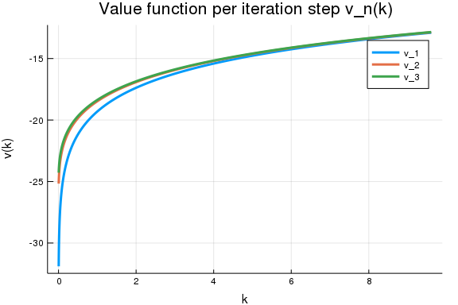
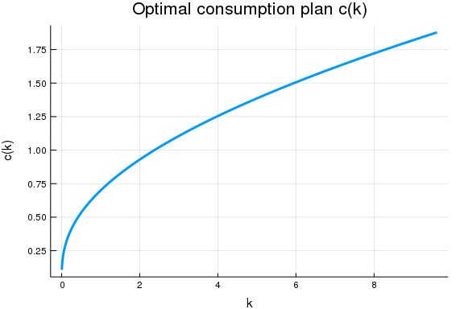

### About this document
Presented by Chiyoung Ahn (@chiyahn), written for `Weave.jl`. 

The notebook is based on Ben Moll's notes in http://www.princeton.edu/~moll/HACTproject/HACT_Additional_Codes.pdf and http://www.princeton.edu/~moll/HACTproject/HJB_NGM_implicit.m

~~~~{.julia}
using LinearAlgebra, Parameters, Plots, BenchmarkTools
gr(fmt = :png); # save plots in .png
~~~~~~~~~~~~~

## Setup

### Production function
~~~~{.julia}
A_productivity = 1.0
α = 0.3 
F(k) = A_productivity*k^α;
~~~~~~~~~~~~~

### Utility function
~~~~{.julia}
γ = 2.0
u(c) = c^(1-γ)/(1-γ) # payoff function by control variable (consumption)
u_prime(c) = c^(-γ) # derivative of payoff function by control variable (consumption)
~~~~~~~~~~~~~

### Law of motion
~~~~{.julia}
δ = 0.05
f(k, c) = F(k) - δ*k - c; # law of motion for state variable (saving)
~~~~~~~~~~~~~

### Consumption function by inverse (`v_prime`)
~~~~{.julia}
c(v_prime) = v_prime^(-1/γ); # consumption by derivative of value function at certain k
~~~~~~~~~~~~~

### Parameters and grids
~~~~{.julia}
# ρ: utility discount rate
# δ: capital discount rate
# γ: CRRA parameter
# F: production function that maps k to a real number
# u: utility function that maps c to a real number
# u_prime: derivative of utility function that maps c to a real number
# f: law of motion function that maps k (state), c (control) to the derivative of k
# c: consumption function that maps v_prime (derivative of v at certain k) to a real number
# c_ss: consumption (control) when v' = 0 (i.e. steady state)
params = (ρ = 0.05, δ = δ, γ = γ, F = F, u = u, u_prime = u_prime, f = f, c = c, c_ss = 0.0)
~~~~~~~~~~~~~

~~~~{.julia}
# ks: grids for states (k) -- assume uniform grids
# Δv: step size for iteration on v
# vs0: initial guess for vs
# maxit: maximum number of iterations
# threshold: threshold to be used for termination condition (maximum(abs.(vs-vs_new)) < threshold)
# verbose: boolean that ables/disables a verbose option
k_ss = (α*A_productivity/(params.ρ+params.δ))^(1/(1-α))
ks = range(0.001*k_ss, stop = 2*k_ss, length = 10000)
settings = (ks = ks,
            Δv = 1000, 
            vs0 = (A_productivity .* ks .^ α) .^ (1-params.γ) / (1-params.γ) / params.ρ,
            maxit = 100, threshold = 1e-6, verbose = false)
~~~~~~~~~~~~~

### Optimal plan solver
~~~~{.julia}
function compute_optimal_plans(params, settings)
    @unpack ρ, δ, γ, F, u, u_prime, f, c, c_ss = params
    @unpack ks, Δv, vs0, maxit, threshold, verbose = settings

    P = length(ks) # size of grids
    Δk = ks[2] - ks[1] # assume uniform grids

    # initial guess
    vs = vs0; 
    # save control (consumption) plan as well
    cs = zeros(P) 

    # begin iterations
    for n in 1:maxit
        # compute derivatives by FD and BD
        dv = diff(vs) ./ Δk
        dv_f = [dv; NaN] # forward difference
        dv_b = [NaN; dv] # backward difference
        dv_0 = u_prime.(f.(ks, fill(c_ss, P)))

        # define the corresponding drifts
        drift_f = f.(ks, c.(dv_f)) 
        drift_b = f.(ks, c.(dv_b))

        # steady states at boundary
        drift_f[end] = 0.0
        drift_b[1] = 0.0

        # compute consumptions and corresponding u(v)
        I_f = drift_f .> 0.0
        I_b = drift_b .< 0.0
        I_0 = 1 .- I_f-I_b

        dv_upwind = dv_f.*I_f + dv_b.*I_b + dv_0.*I_0;
        cs = c.(dv_upwind)
        us = u.(cs)

        # define the matrix A
        drift_f_upwind = max.(drift_f, 0.0) ./ Δk
        drift_b_upwind = min.(drift_b, 0.0) ./ Δk
        A = LinearAlgebra.Tridiagonal(-drift_b_upwind[2:P], 
                (-drift_f_upwind + drift_b_upwind), 
                drift_f_upwind[1:(P-1)]) 

        # solve the corresponding system to get vs_{n+1}
        vs_new = (Diagonal(fill((ρ + 1/Δv), P)) - A) \ (us + vs / Δv)

        # show distance between vs_{n+1} and vs_n if verbose option is one
        if (verbose) @show maximum(abs.(vs - vs_new)) end
        
        # check termination condition 
        if (maximum(abs.(vs-vs_new)) < threshold)
            if (verbose) println("Value function converged -- total number of iterations: $n") end
            return (vs = vs, cs = cs)
        end
        
        # update vs_{n+1}
        vs = vs_new
    end
    return (vs = vs, cs = cs) 
end
~~~~~~~~~~~~~

~~~~
compute_optimal_plans (generic function with 1 method)
~~~~

## Solve
~~~~{.julia}
vs, cs = @btime compute_optimal_plans(params, settings)
~~~~~~~~~~~~~

~~~~
75.689 ms (2865976 allocations: 61.75 MiB)
~~~~

## Plots
### `v(k)`
~~~~{.julia}
plot(ks, vs,
    linewidth = 3,
    title="Value function v(k)",xaxis="k",yaxis="v(k)",legend=false)
~~~~~~~~~~~~~

\ 

### `c(k)`
~~~~{.julia}
plot(ks, cs,
    lw = 3,
    title="Optimal consumption plan c(k)",xaxis="k",yaxis="c(k)",legend=false)
~~~~~~~~~~~~~

\ 

### `s(k)`
~~~~{.julia}
savings = f.(ks, cs) # Savings (states) according to optimal consumption plan
plot(ks, savings,
    linewidth = 3,
    title="Optimal saving plan s(k)",xaxis="k",yaxis="s(k)",legend=false)
plot!([.0], st = :hline, linestyle = :dot, lw = 3) # zero saving line
~~~~~~~~~~~~~

\ 

